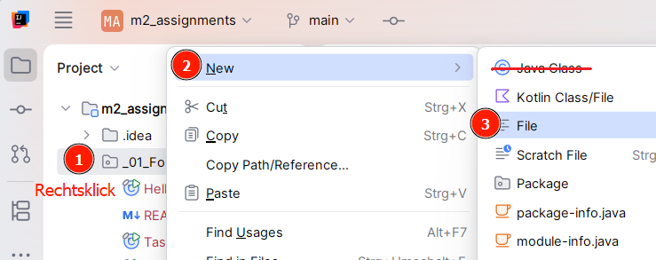

# Notenliste

Erstellen Sie eine Datei `GradeCalc.java` in diesem Verzeichnis.

Rechtsklicken Sie auf diesen Ordner und erstellen Sie eine _einfache_ Datei.
**Keine** "Java Class." Vergessen Sie nicht die `.java`-Endung bei der Dateibenennung:



> Wir erstellen erstmal keine Git-Commits. Ob Sie in dem Popup die Datei zu Git "hinzufügen" ist Ihnen
> überlassen. Die Datei erscheint grün, wenn Sie "Ok" wählen und rot, wenn Sie "abbrechen" wählen 
> (blaue Dateien wurden vom Dozenten "committet" und von Ihnen bearbeitet).
> Die Farbe der Datei ist aber nur als Hilfe für Git-Commits gedacht und spielt für uns keine Rolle.

## Aufgabe 1: Noteneingabe
Ein Dozent möchte **fünf Noten** speichern.
Legen Sie dafür ein Array mit Platz für **fünf Zahlen** (`double`) an.
Lesen Sie anschließend mit `IO.readln()` fünf Noten ein und speichern Sie diese im Array.
Geben Sie danach alle eingegebenen Noten wieder aus.
Eine mögliche _Eingabe_ könnte so aussehen:

```
Note 1: 2
Note 2: 3
Note 3: 1
Note 4: 4.3
Note 5: 2
```

Die Ausgabe soll anschließend so aussehen:

```
Noten:
2.0
3.0
1.0
4.3
2.0
```

Verwenden Sie für das Einlesen und für die Ausgabe jeweils eine Schleife
(also **zwei Schleifen** insgesamt).

Verwenden Sie außerdem überall (wo möglich) `myArr.length` anstelle der Zahl `5` in Ihrem Code.
So kann die Arraygröße später leichter angepasst werden.

Vergessen Sie nicht, die Eingabe des Users zu Konvertieren:
```java
double myDouble = Double.parseDouble(userInputString);
```

> **ACHTUNG:**
> Kommazahlen müssen im Terminal mit einem **PUNKT** eingegeben werden! **Nicht** mit einem Komma!

Fangen Sie erstmal keine ungültigen Noten ab (Zahlen nicht zwischen `1.0` und `6.0`).
Rüsten Sie eine Eingabevalidierung nach, **wenn Sie mit allen Aufgaben auf dem Blatt fertig sind.**

## Aufgabe 2: Summe und Durchschnitt

Erweitern Sie die vorherige Aufgabe.
Berechnen Sie die **Summe aller Noten** und anschließend den **Durchschnitt**.

Bei den Noten: `2, 3, 1, 4, 2` soll die Ausgabe bspw. so aussehen:

```
Summe: 12
Durchschnitt: 2.4
```

Sie können eine neue Schleife zwischen den beiden Schleifen aus Aufgabe 1 anlegen.
Sie können aber auch die erste Eingabeschleife für die Aufsummierung mitverwenden.
Eingabe und Logik voneinander zu trennen (mit mehreren Schleifen) kann den Code
simpler und leichter anpassbar machen.
In diesem Fall sind aber beide Varianten legitim.


## Aufgabe 3: Filtern

Erweitern Sie die Notenverwaltung weiter.

Zählen Sie, wie viele Schüler eine **gute Note** erhalten haben.
Definieren Sie selbst eine Grenze, ab der eine Note als "gut" mitgezählt werden soll.

Fügen Sie die Anzahl dann zu Ihrer Ausgabe hinzu:
```
Anzahl gute Noten: 3
```

### Zusatz

Geben Sie zusätzlich aus, wie viele Schüler **nicht bestanden** haben.
Als nicht bestanden gilt eine Note von **4.5** oder schlechter.
